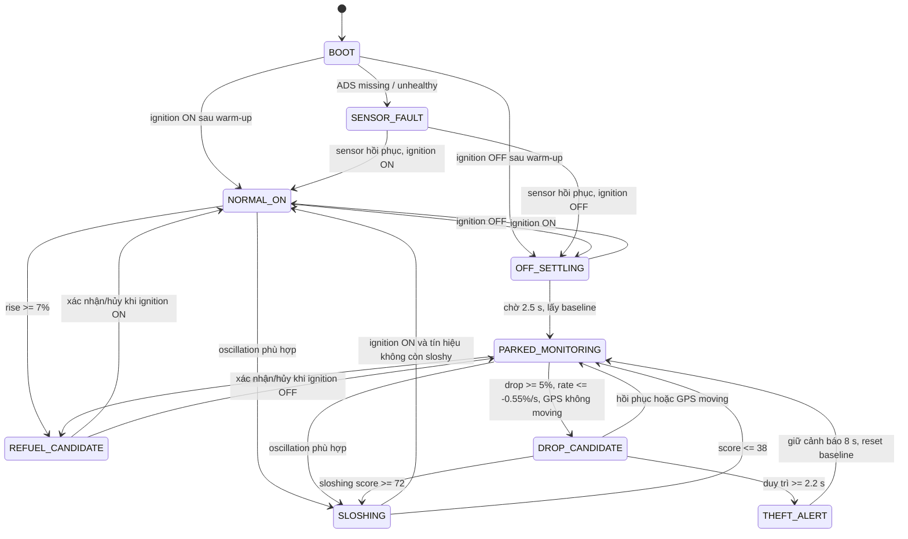
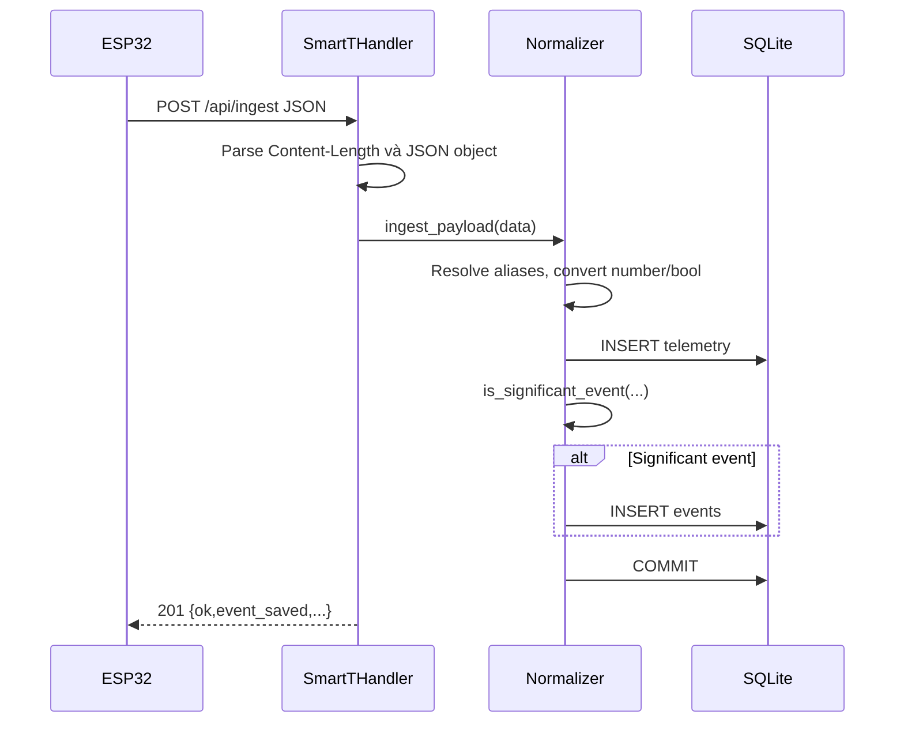

# SmartT — Tài liệu logic backend và thuật toán xử lý nhiên liệu

> **Phạm vi tài liệu:** mô tả trực tiếp logic đang được triển khai trong mã nguồn của gói `SmartT (6).zip`, tập trung vào firmware ESP32, xử lý tín hiệu, máy trạng thái phát hiện sự kiện, truyền telemetry, server cục bộ và SQLite. Các chi tiết thuần giao diện, bố cục dashboard và UI/UX được lược bỏ.
>
> **Nguồn sự thật:** mã nguồn hiện tại, đặc biệt là `SmartT_Core_Demo/`, `server/app.py` và phần giao tiếp API của local dashboard. Tài liệu này mô tả **hệ thống đang chạy**, không đồng nhất mọi ý tưởng trong roadmap với tính năng đã được triển khai.

---

## 1. Tóm tắt hệ thống

SmartT hiện là một hệ thống giám sát nhiên liệu theo kiến trúc edge-first:

1. ESP32 đọc tín hiệu analog của cảm biến mức nhiên liệu thông qua ADS1115.
2. Điện áp được hiệu chuẩn tuyến tính thành phần trăm nhiên liệu.
3. Tín hiệu đi qua bộ lọc median và EMA để giảm spike và rung.
4. Hệ thống tính tốc độ thay đổi nhiên liệu, độ ổn định tín hiệu và điểm sloshing.
5. Trạng thái khóa điện và chuyển động GPS được dùng làm ngữ cảnh.
6. Máy trạng thái luật lệ phân loại:
   - bình thường;
   - xe vừa tắt máy và đang chờ ổn định;
   - xe đỗ và đang giám sát;
   - nhiên liệu dao động/sloshing;
   - ứng viên tụt nhiên liệu;
   - nghi ngờ trộm/rút nhiên liệu;
   - ứng viên tiếp nhiên liệu;
   - lỗi cảm biến.
7. ESP32 xuất một snapshot JSON chứa telemetry và kết quả suy luận.
8. Snapshot có thể được:
   - đọc trực tiếp qua API trên ESP32;
   - in qua Serial;
   - POST định kỳ tới local server.
9. Local server chuẩn hóa payload, lưu mọi snapshot vào SQLite, tách các snapshot đáng chú ý sang bảng `events`, sau đó cung cấp API cho dashboard.

### 1.1. Bản chất thuật toán

Thuật toán hiện tại là **deterministic rule-based algorithm**, không phải mô hình machine learning. Cốt lõi của nó gồm:

- calibration tuyến tính;
- averaging tại tầng ADC;
- median filter;
- exponential moving average;
- đạo hàm rời rạc để tính tốc độ thay đổi;
- các đặc trưng dao động trong cửa sổ thời gian;
- finite-state machine;
- confirmation timer;
- hysteresis/recovery rule;
- confidence score dạng cộng/trừ trọng số.

Điểm mạnh của cách này trong cuộc thi là dễ giải thích, chạy hoàn toàn trên ESP32, không cần cloud và có thể truy vết rõ lý do tạo cảnh báo.

---

## 2. Kiến trúc logic tổng thể

```mermaid
flowchart LR
    A[Fuel sender / potentiometer] --> B[ADS1115 A0 và A1]
    B --> C[Average 4 mẫu mỗi kênh]
    C --> D[Voltage to fuel percent]
    D --> E[Median filter 5 mẫu]
    E --> F[EMA mức nhiên liệu]
    F --> G[Tính rate và EMA rate]
    F --> H[Cửa sổ stability 10 mẫu]
    H --> I[Signal stability]
    H --> J[Sloshing score]

    K[Ignition input] --> M[EventDetector FSM]
    L[GPS speed/freshness] --> M
    G --> M
    I --> M
    J --> M
    M --> N[Current event + confidence + alert]

    N --> O[Telemetry JSON]
    F --> O
    G --> O
    I --> O
    J --> O
    L --> O

    O --> P[ESP32 API /api/telemetry]
    O --> Q[Serial JSON]
    O --> R[HTTP POST /api/ingest]
    R --> S[Local Python server]
    S --> T[(SQLite telemetry)]
    S --> U[(SQLite events)]
    T --> V[/api/latest và /api/history]
    U --> W[/api/events]
```

### 2.1. Các module chính

| Module | Trách nhiệm logic |
|---|---|
| `SmartT_Core_Demo.ino` | Điều phối vòng lặp, lịch lấy mẫu, gọi các module và xuất dữ liệu. |
| `Config.h` | Chứa calibration, ngưỡng, thời gian xác nhận, tần suất và feature flag. |
| `Types.h` | Định nghĩa toàn bộ state dùng chung giữa các module. |
| `FuelSensor` | Đọc ADS1115, đổi điện áp sang phần trăm và kiểm tra sức khỏe cảm biến. |
| `FuelFilter` | Median, EMA, rate, signal stability và sloshing score. |
| `GpsContext` | Đọc NMEA, đánh giá độ mới dữ liệu và xác nhận chuyển động. |
| `EventDetector` | Máy trạng thái phát hiện refuel, sloshing, fuel drop và theft anomaly. |
| `WebDashboard` | Serialize state thành JSON và cung cấp API trực tiếp trên ESP32. |
| `LocalServerClient` | Kết nối Wi-Fi hạ tầng và POST telemetry tới local server. |
| `server/app.py` | HTTP server, ingest, chuẩn hóa, SQLite và API truy vấn. |

---

## 3. Chu kỳ thực thi trên ESP32

## 3.1. Khởi động

Trong `setup()`, firmware thực hiện theo thứ tự:

1. Mở Serial ở `115200 baud`.
2. Cấu hình input khóa điện và nút test bằng `INPUT_PULLUP`.
3. Cấu hình LED cảnh báo.
4. Khởi tạo I2C trên GPIO 21/22, tốc độ 100 kHz.
5. Khởi tạo UART2 cho GPS trên GPIO 13/14, 9600 baud.
6. Khởi tạo ADS1115 tại địa chỉ `0x48`, gain `GAIN_ONE`.
7. Khởi tạo OLED.
8. Khởi tạo access point và web server trên ESP32.
9. Nếu có cấu hình, khởi tạo client đẩy dữ liệu tới local server.
10. Lấy một mẫu ban đầu, seed bộ lọc và khởi tạo máy trạng thái.

Nếu OLED lỗi, phần còn lại vẫn chạy. Nếu ADS1115 lỗi, máy trạng thái chuyển sang nhánh sensor fault thay vì tạo cảnh báo trộm giả.

## 3.2. Vòng lặp

Firmware không dùng RTOS task riêng mà điều phối bằng `millis()`:

| Tác vụ | Chu kỳ |
|---|---:|
| Đọc byte GPS từ UART | Mỗi vòng `loop()` khi có dữ liệu |
| Xử lý HTTP client trên ESP32 | Mỗi vòng `loop()` |
| Lấy mẫu và cập nhật thuật toán | 250 ms |
| In telemetry JSON ra Serial | 500 ms |
| Thử POST local server | tối đa một lần mỗi 5.000 ms |
| Refresh OLED | 500 ms |

Mỗi chu kỳ xử lý 250 ms chạy theo pipeline cố định:

```text
readVehicleInputs()
→ FuelSensor.read()
→ FuelFilter.update()
→ FuelSensor.updateHealth()
→ GpsContext.update()
→ EventDetector.update()
→ updateAlertLed()
```

Thứ tự này quan trọng: máy trạng thái luôn nhận dữ liệu nhiên liệu đã lọc, health mới nhất và ngữ cảnh GPS mới nhất của cùng chu kỳ.

---

## 4. Mô hình state dùng chung

Toàn bộ module thao tác trên một biến `DashboardState dashboard`.

### 4.1. FuelTelemetry

Các nhóm dữ liệu chính:

- ADC thô: `rawA0`, `rawA1`;
- điện áp: `voltsA0`, `voltsA1`;
- phần trăm theo từng kênh: `percentA0`, `percentA1`;
- mức nhiên liệu đầu vào thuật toán: `rawPercent`;
- mức đã lọc: `filteredPercent`;
- thể tích ước tính: `liters`;
- chênh lệch so với parked baseline: `deltaPercent`, `deltaLiters`;
- tốc độ thay đổi: `rawRatePercentPerSec`, `ratePercentPerSec`;
- baseline và candidate: `parkedBaselinePercent`, `candidateDropPercent`;
- chất lượng tín hiệu: `signalStability`, `sloshingScore`;
- cờ khởi tạo bộ lọc: `filterReady`.

### 4.2. GpsTelemetry

Chứa:

- tọa độ, tốc độ, số vệ tinh, thời gian GPS;
- `dataFresh` cho vị trí;
- `speedFresh` cho tốc độ;
- trạng thái `stationary`, `moving`;
- `motionState`;
- `usedInDecision` và `decisionContext` để giải thích GPS đã ảnh hưởng đến quyết định ra sao.

### 4.3. VehicleContext

- `ignitionOn`: đọc từ GPIO 19, active-low;
- `testPressed`: đọc từ GPIO 4, active-low.

### 4.4. SensorHealth

- ADS1115 có sẵn hay không;
- OLED có sẵn hay không;
- tín hiệu có được xem là khỏe hay không;
- status chi tiết như `OK`, `STABLE_SIGNAL`, `OUT_OF_RANGE`, `ADS_MISSING`.

### 4.5. FuelEvent

Một kết quả sự kiện gồm:

- `code`: mã kỹ thuật;
- `message`: mô tả thân thiện;
- `alert`: mã cảnh báo;
- `ruleResult`: rule/evidence chính;
- delta phần trăm và lít;
- rate tại thời điểm tạo;
- confidence 0–100;
- timestamp theo `millis()`.

---

## 5. Đọc cảm biến và calibration

## 5.1. ADS1115

Mỗi lần `FuelSensor.read()`:

- đọc A0 bốn lần;
- đọc A1 bốn lần;
- cộng raw ADC và điện áp;
- lấy trung bình cho từng kênh;
- có `delay(2)` sau mỗi lần đọc.

Công thức trung bình:

```text
raw_mean = sum(raw_i) / 4
voltage_mean = sum(voltage_i) / 4
```

Với hai kênh, riêng các lệnh delay tạo tối thiểu khoảng 16 ms blocking trong mỗi chu kỳ lấy mẫu, chưa tính thời gian chuyển đổi/I2C.

## 5.2. Chọn kênh nhiên liệu chính

Feature flag:

```cpp
SMARTT_USE_A1_BACKUP_AS_MAIN_FUEL = 0
```

Do đó mặc định:

```text
rawPercent = percentA0
```

A1 chỉ là kênh backup/potentiometer. Khi đổi flag thành 1, A1 trở thành nguồn chính mà không cần sửa thuật toán phía sau.

## 5.3. Calibration tuyến tính

Mặc định A0 được calibration:

```text
EMPTY = 0.03 V
FULL  = 0.31 V
```

A1:

```text
EMPTY = 0.00 V
FULL  = 3.30 V
```

Công thức chưa clamp:

```text
fuel_percent_unclamped = (voltage - empty_voltage) × 100
                         --------------------------------
                           full_voltage - empty_voltage
```

Giá trị dùng làm mức nhiên liệu hiển thị được clamp về `[0, 100]`.

Điểm đáng chú ý:

- calibration hiện là một đường thẳng hai điểm;
- không có lookup table theo hình dạng bình;
- không có temperature compensation;
- không có calibration profile riêng cho nhiều loại xe trong runtime;
- dung tích bình được hard-code theo thiết bị.

## 5.4. Đổi phần trăm sang lít

```text
fuel_liters = clamp(filtered_percent, 0, 100)
              × tank_capacity_liters / 100
```

Dữ liệu hiện tại:

```text
vehicle_id = TRUCK_01
tank_capacity = 180 L
```

Ví dụ:

```text
52% → 93.6 L
```

---

## 6. Kiểm tra sức khỏe cảm biến

`FuelSensor.updateHealth()` chạy sau bộ lọc nhưng kiểm tra trực tiếp nguồn ADS và tỷ lệ phần trăm chưa clamp.

### 6.1. ADS1115 không tồn tại

```text
healthy = false
status = ADS_MISSING
```

Máy trạng thái sẽ chuyển sang `DETECTOR_SENSOR_FAULT` và không suy luận trộm nhiên liệu.

### 6.2. Giá trị ngoài biên calibration

Biên cho phép:

```text
-5% ≤ fuel_percent_unclamped ≤ 105%
```

Ngoài khoảng này:

```text
healthy = false
status = OUT_OF_RANGE
```

Biên dư ±5% giúp tránh báo lỗi chỉ vì nhiễu nhỏ sát EMPTY/FULL.

### 6.3. Tín hiệu không đổi lâu

Hệ thống theo dõi lần cuối raw fuel thay đổi quá `0.15 percentage point`.

Nếu không có thay đổi đáng kể trong hơn 15 giây:

```text
healthy = true
status = STABLE_SIGNAL
```

Đây là chủ ý của code: bình nhiên liệu của xe đang đỗ có thể phẳng lâu, vì vậy tín hiệu phẳng **không bị coi là sensor stuck fault**.

Hệ quả: một dây tín hiệu bị treo ở một giá trị hợp lệ cũng có thể bị xem là `STABLE_SIGNAL`. Logic hiện tại phát hiện missing/out-of-range tốt hơn phát hiện cảm biến bị kẹt tại một mức hợp lệ.

---

## 7. Bộ lọc nhiên liệu

Pipeline lọc gồm ba tầng:

```text
ADC averaging
→ median 5 mẫu
→ EMA mức nhiên liệu
→ derivative
→ EMA tốc độ thay đổi
```

## 7.1. Khởi tạo

Ở mẫu đầu tiên, `FuelFilter.reset()`:

- seed toàn bộ median buffer bằng raw fuel hiện tại;
- seed toàn bộ stability window bằng cùng giá trị;
- filtered fuel bằng seed;
- rate bằng 0;
- đánh dấu `filterReady = true`.

Do buffer được seed đầy ngay lập tức, hệ thống không phải chờ đủ 5 hoặc 10 mẫu mới chạy. Tuy nhiên các mẫu đầu sau boot vẫn chịu ảnh hưởng mạnh của seed ban đầu.

## 7.2. Median filter 5 mẫu

Kích thước:

```text
FUEL_MEDIAN_SIZE = 5
```

Mỗi mẫu mới ghi vào circular buffer, sau đó firmware copy dữ liệu sang mảng tạm, insertion sort và lấy phần tử giữa:

```text
median = sorted_samples[2]
```

Mục tiêu:

- loại spike đơn lẻ;
- chống nhiễu chớp ngắn;
- không làm lệch mạnh như moving average khi có một outlier lớn.

Với chu kỳ 250 ms, cửa sổ nominal tương ứng khoảng 1,25 giây.

## 7.3. EMA mức nhiên liệu

Hệ số:

```text
FUEL_EMA_ALPHA = 0.18
```

Công thức:

```text
filtered_t = filtered_(t-1)
             + 0.18 × (median_t - filtered_(t-1))
```

Alpha nhỏ làm tín hiệu mượt hơn nhưng tăng độ trễ. Với chu kỳ 250 ms, time constant xấp xỉ của riêng EMA này khoảng 1,26 giây; để tiến gần 90% một bước nhảy cần khoảng vài giây. Khi kết hợp median, phản ứng thực tế với thay đổi đột ngột chậm hơn timer xác nhận thuần túy.

## 7.4. Tốc độ thay đổi nhiên liệu

Đầu tiên tính raw rate trên mức đã lọc:

```text
dt = (now - last_rate_time) / 1000
raw_rate = (filtered_t - filtered_(t-1)) / dt
```

Đơn vị:

```text
percentage point / second
```

Sau đó lọc tiếp:

```text
rate_t = rate_(t-1) + 0.25 × (raw_rate - rate_(t-1))
```

Với:

```text
RATE_EMA_ALPHA = 0.25
```

Thuật toán sự kiện dùng `ratePercentPerSec` đã lọc, không dùng raw rate.

---

## 8. Signal stability và sloshing score

Hai metric được tính từ 10 mẫu `filteredPercent` gần nhất.

```text
FUEL_STABILITY_WINDOW_SIZE = 10
```

Với chu kỳ 250 ms, cửa sổ đại diện khoảng 2,5 giây.

## 8.1. Các đặc trưng trong cửa sổ

Firmware tính:

```text
range = max(sample) - min(sample)
mean_abs_step = sum(abs(sample_i - sample_(i-1))) / (N - 1)
sustained_change = abs(last_sample - first_sample)
direction_changes = số lần hướng tăng/giảm đảo chiều
```

Một step chỉ được xem có hướng nếu:

```text
abs(step) > 0.05 percentage point
```

## 8.2. Instability

```text
instability = range × 6
              + mean_abs_step × 10
              + direction_changes × 4
```

```text
signal_stability = 100 - clamp(instability, 0, 100)
```

Diễn giải:

- 100: cực kỳ ổn định;
- thấp dần khi biên độ, step và số lần đổi hướng tăng;
- ngưỡng “đủ ổn định” của detector là 65.

## 8.3. Sloshing score

```text
oscillation = range × 8
              + mean_abs_step × 14
              + direction_changes × 8
              - sustained_change × 6
```

```text
sloshing_score = clamp(oscillation, 0, 100)
```

Ý nghĩa của thành phần trừ `sustained_change`:

- dao động lên xuống nhiều nhưng quay về gần mức ban đầu → score cao;
- thay đổi một chiều bền vững → bị trừ điểm, ít giống sloshing hơn.

Các ngưỡng:

| Hằng số | Giá trị | Vai trò |
|---|---:|---|
| `SIGNAL_STABILITY_MIN_STABLE` | 65 | Tín hiệu đủ ổn định để cập nhật baseline hoặc hỗ trợ xác nhận. |
| `SLOSHING_SCORE_EVENT` | 60 | Bắt đầu xem tín hiệu có đặc trưng sloshing. |
| `SLOSHING_SCORE_SUPPRESS_THEFT` | 72 | Trong drop candidate, sloshing mạnh có thể hủy hướng theft. |
| `SLOSHING_SCORE_CLEAR` | 38 | Khi xe tắt, thoát state sloshing sau khi tín hiệu đã lắng rõ rệt. |

## 8.4. Điều kiện `signalLooksSloshy()`

Không phải cứ score ≥ 60 là gắn nhãn sloshing. Điều kiện thực tế:

```text
sloshing_score ≥ 60
AND
(
    abs(delta_from_baseline) < 5%
    OR abs(filtered_rate) < 0.55 %/s
)
```

Mục tiêu là tránh dùng sloshing để che một thay đổi lớn, nhanh và bền vững. Tuy nhiên trong state `DROP_CANDIDATE`, nếu score đạt 72 thì detector có nhánh suppress riêng mạnh hơn.

---

## 9. Ngữ cảnh GPS

GPS được xử lý bằng TinyGPS++ từ NMEA trên UART2.

## 9.1. Freshness

Vị trí và tốc độ được kiểm tra riêng:

```text
fresh nếu valid và age < 5.000 ms
```

- `gps.fix` phản ánh location fresh;
- quyết định chuyển động dựa vào `speedFresh`;
- có vị trí nhưng tốc độ stale vẫn không đủ để kết luận moving/stationary.

## 9.2. Phân vùng tốc độ

| Tốc độ | Motion state sơ bộ |
|---|---|
| `≤ 3 km/h` | `STATIONARY` |
| `3–8 km/h` | `SLOW_MOVEMENT` |
| `≥ 8 km/h` | `MOVING` |

Để `stationary = true` hoặc `moving = true`, trạng thái tương ứng phải duy trì ít nhất:

```text
GPS_MOTION_CONFIRM_MS = 3.000 ms
```

Khi tốc độ nằm trong vùng 3–8 km/h, cả hai timer xác nhận bị reset.

## 9.3. GPS trong quyết định theft

Hàm `gpsAllowsParkedTheftDecision()`:

```text
speed không fresh  → cho phép detector tiếp tục bằng fallback
GPS moving         → chặn parked theft
GPS stationary     → ủng hộ parked theft
slow/uncertain     → vẫn cho phép detector tiếp tục
```

Điều này thể hiện triết lý:

- GPS là context hỗ trợ và suppress false positive;
- GPS không phải dependency bắt buộc;
- khi GPS mất, hệ thống vẫn có thể cảnh báo từ nhiên liệu + ignition.

Trade-off: fallback giúp hệ thống không bị vô hiệu khi mất GPS, nhưng tăng khả năng false positive nếu xe thực tế đang di chuyển mà GPS không có dữ liệu.

---

## 10. Máy trạng thái phát hiện sự kiện

Các state:

```text
BOOT
NORMAL_ON
OFF_SETTLING
PARKED_MONITORING
SLOSHING
DROP_CANDIDATE
THEFT_ALERT
REFUEL_CANDIDATE
SENSOR_FAULT
```



---

## 11. Warm-up và sensor fault

## 11.1. Warm-up

Trong 2,5 giây đầu tính từ boot:

```text
current_event = WARMING_UP
```

Detector chưa chạy logic theft/refuel. Nếu ADS có mặt, sensor status là `WARMING_UP`; nếu không có là `ADS_MISSING`.

Lưu ý: điều kiện dùng `millis() < 2500`, tức là thời gian tuyệt đối từ lúc ESP32 boot, không phải 2,5 giây kể từ lúc bộ lọc ready.

## 11.2. Sensor fault priority

Sau warm-up:

1. ADS missing được kiểm tra trước;
2. sensor unhealthy được kiểm tra tiếp;
3. chỉ khi sensor hợp lệ mới xử lý ignition và fuel state machine.

Do đó lỗi sensor có priority cao hơn mọi sự kiện nhiên liệu.

---

## 12. Logic ignition và parked baseline

## 12.1. Khi ignition ON

- không tạo theft alert;
- xóa drop candidate;
- không xem parked baseline là ready;
- vẫn phát hiện refuel;
- vẫn phân loại sloshing;
- nếu rate giảm nhanh hơn hoặc bằng `-0.55 %/s`, tạo event thông tin `FAST_DROP_IGN_ON`, nhưng không tạo alert.

Lý do: khi xe hoạt động, nhiên liệu có thể giảm do tiêu thụ, dốc, phanh, rung hoặc chuyển động của phao.

## 12.2. Khi ignition chuyển OFF

Detector chuyển sang:

```text
OFF_SETTLING
```

và chờ:

```text
IGNITION_OFF_SETTLE_MS = 2.500 ms
```

Sau thời gian này:

```text
parkedBaselinePct = current filtered fuel
parkedBaselineReady = true
state = PARKED_MONITORING
```

Thay đổi nhiên liệu xảy ra hoàn toàn trong 2,5 giây settling có thể bị hấp thụ vào baseline mới và không được phân loại thành refuel/drop.

## 12.3. Baseline thích nghi chậm

Khi đang parked monitoring, baseline chỉ được cập nhật nếu đồng thời:

```text
ignition OFF
baseline đã ready
abs(rate) <= 0.15 %/s
signal_stability >= 65
abs(current_fuel - baseline) <= 1.5%
đã qua ít nhất 5 s từ lần cập nhật trước
```

Khi đủ điều kiện:

```text
baseline = current_fuel
```

Mục tiêu:

- bám drift nhỏ của sensor;
- không bám theo một đợt rút nhiên liệu lớn;
- không bám khi tín hiệu đang rung.

Với bình 180 L, drift tối đa cho phép cập nhật là 2,7 L.

---

## 13. Phát hiện tiếp nhiên liệu

Refuel được xét cả khi ignition ON và OFF.

## 13.1. Bắt đầu candidate

```text
rise = filtered_fuel - reference_baseline
```

Nếu:

```text
rise >= 7%
```

thì chuyển sang `REFUEL_CANDIDATE`.

Với bình 180 L:

```text
7% = 12,6 L
```

Reference được chụp từ `parkedBaselinePct` tại lúc bắt đầu candidate.

## 13.2. Hủy candidate

Candidate bị hủy nếu rise giảm xuống dưới:

```text
REFUEL_MIN_RISE_PCT - THEFT_CANCEL_RECOVERY_PCT
= 7% - 2%
= 5%
```

Đây là hysteresis để tránh bật/tắt liên tục đúng tại ngưỡng 7%.

## 13.3. Xác nhận refuel

Cần đủ thời gian:

```text
elapsed >= 1.800 ms
```

và ít nhất một điều kiện ổn định:

```text
abs(rate) <= 0.50 %/s
OR signal_stability >= 65
OR rise >= 10.5%
```

Trong đó `10.5% = 7% × 1.5`.

Khi xác nhận:

```text
event = REFUEL_EVENT
baseline = current_fuel
candidate reset
state trở về NORMAL_ON hoặc PARKED_MONITORING
```

Nếu ignition OFF, baseline tiếp tục được xem là ready. Nếu ignition ON, baseline được lưu nhưng flag ready vẫn false cho logic parked theft.

## 13.4. Refuel confidence

```text
score = 55
        + (rise - 7) × 4
        + (signal_stability - 50) × 0.15
        - sloshing_score × 0.10
```

Nếu:

```text
rate >= -0.10 %/s
```

thêm 10 điểm.

Sau đó clamp và làm tròn:

```text
confidence = round(clamp(score, 0, 100))
```

## 13.5. Điểm cần lưu ý

`REFUEL_EVENT` được set tại chu kỳ xác nhận, sau đó state ngay lập tức trở về normal/parked. Ở chu kỳ lấy mẫu kế tiếp, `current_event` thường trở lại `NORMAL` hoặc `PARKED_MONITORING`.

Vì local server chỉ nhận snapshot mỗi 5 giây, một event tồn tại khoảng một chu kỳ 250 ms có xác suất cao bị bỏ lỡ. ESP32 có lưu event vào ring buffer `recent_events`, nhưng server hiện không ingest các phần tử trong mảng này.

Đây là rủi ro dữ liệu quan trọng nhất trong luồng refuel hiện tại.

---

## 14. Phát hiện sloshing

Sloshing là lớp chống false positive, không tạo theft alert.

## 14.1. Vào state sloshing

Trong `NORMAL_ON` hoặc `PARKED_MONITORING`, nếu `signalLooksSloshy()` trả về true:

```text
state = SLOSHING
event = SLOSHING_DETECTED
rule_result = Signal unstable
```

## 14.2. Thoát sloshing khi xe đỗ

Trong nhánh ignition OFF:

```text
sloshing_score <= 38
→ PARKED_MONITORING
```

Khoảng vào 60 và thoát 38 tạo hysteresis, tránh chuyển state liên tục khi score quanh ngưỡng.

## 14.3. Sloshing confidence

```text
score = sloshing_score
```

Nếu:

```text
signal_stability < 65
```

thêm 10 điểm, sau đó clamp về 0–100.

## 14.4. Suppress theft candidate

Trong `DROP_CANDIDATE`, nếu:

```text
sloshing_score >= 72
AND drop < worst_drop + 2%
```

thì candidate bị hủy và chuyển sang `SLOSHING`.

Do `worst_drop` là drop lớn nhất đã thấy, điều kiện `current_drop < worst_drop + 2%` thường khá dễ đúng. Khi sloshing score vượt 72, nhánh này có sức suppress mạnh.

---

## 15. Phát hiện tụt nhiên liệu nghi ngờ trộm

Logic theft chỉ được xác nhận khi ignition OFF.

## 15.1. Điều kiện bắt đầu drop candidate

Trong `PARKED_MONITORING`:

```text
drop = parked_baseline - current_filtered_fuel
```

Bắt đầu candidate nếu:

```text
drop >= 5%
AND rate <= -0.55 %/s
AND GPS không xác nhận moving
```

Với bình 180 L:

```text
5% = 9 L
-0.55 %/s ≈ -0.99 L/s
```

Đây là ngưỡng demo khá nhanh; không phải ngưỡng đã được hiệu chuẩn cho mọi xe thực tế.

Khi bắt đầu:

```text
candidateStartMs = now
candidateWorstDrop = current drop
state = DROP_CANDIDATE
event = FUEL_DROP_CANDIDATE
```

## 15.2. Hủy candidate do hồi phục

Candidate bị hủy nếu một trong hai điều kiện:

```text
current_fuel >= baseline - 2%
OR rate > +0.20 %/s
```

Điều kiện đầu tương đương drop đã hồi về ≤ 2%.

Với bình 180 L:

```text
2% = 3,6 L
```

## 15.3. Hủy candidate do GPS

Nếu GPS chuyển sang `moving = true`:

```text
state → PARKED_MONITORING
event = FUEL_DROP_WHILE_MOVING
không tạo alert
```

## 15.4. Xác nhận theft

Cần đồng thời:

```text
candidate tồn tại >= 2.200 ms
drop vẫn >= 5%
rate <= +0.20 %/s
GPS không moving
không bị sloshing suppress
```

Khi xác nhận:

```text
state = THEFT_ALERT
event = SUSPICIOUS_DROP
alert = FUEL_THEFT_ANOMALY
rule_result = Stationary drop confirmed
```

## 15.5. Theft confidence

```text
score = 50
        + (drop - 5) × 5
        + abs(rate) × 10
```

Điều chỉnh theo context:

```text
ignition OFF                  +15
GPS stationary               +10
GPS moving                   -30
(signal_stability - 50)×0.12
sloshing_score×(-0.15)
```

Sau đó:

```text
confidence = round(clamp(score, 0, 100))
```

Ví dụ định tính:

- drop lớn hơn → confidence cao hơn;
- drop nhanh hơn → confidence cao hơn;
- xe tắt và GPS đứng yên → tăng confidence;
- GPS đang chạy → giảm mạnh và thực tế còn suppress candidate;
- tín hiệu ổn định → tăng nhẹ;
- sloshing cao → giảm confidence.

## 15.6. Giữ cảnh báo và reset baseline

Sau xác nhận, alert được giữ:

```text
THEFT_ALERT_HOLD_MS = 8.000 ms
```

Hết thời gian:

```text
baseline = current_fuel
state = PARKED_MONITORING
candidate reset
```

Reset baseline là cần thiết để tránh cảnh báo lặp vô hạn sau khi nhiên liệu thực sự đã bị rút.

Lưu ý: trong state `THEFT_ALERT`, delta hiển thị dựa trên `candidateDropPct` tại thời điểm xác nhận; code không cập nhật lại candidate drop theo mức nhiên liệu tiếp tục thay đổi trong 8 giây hold.

---

## 16. Thứ tự ưu tiên phân loại

Thứ tự rule có ảnh hưởng trực tiếp đến kết quả.

### 16.1. Khi ignition ON

```text
1. Refuel rise
2. Sloshing
3. Fast drop informational
4. Normal
```

### 16.2. Khi parked monitoring

```text
1. Refuel rise
2. Sloshing
3. Theft/drop candidate
4. GPS moving with ignition off informational
5. Stable baseline drift update
```

Do refuel và sloshing được xét trước theft, một tín hiệu dao động mạnh hoặc tăng rõ rệt sẽ không bị phân loại nhầm thành rút nhiên liệu.

### 16.3. Priority toàn hệ thống

```text
Warm-up
→ ADS missing
→ Sensor unhealthy
→ Ignition transition
→ Fuel state machine
→ Manual test override
```

Manual test override chạy sau detector, vì vậy nó có thể thay thế event xuất ra trong chu kỳ đó mà không thay đổi toàn bộ state nội bộ.

---

## 17. Nút test và LED cảnh báo

## 17.1. Nút test

Khi phát hiện cạnh nhấn:

```text
test override kéo dài 3.500 ms
```

Nếu ignition OFF, đồng thời đặt mốc giữ theft test tới 8 giây tính từ lúc nhấn.

Trong 3,5 giây đầu:

- ignition ON → `DROP_TEST_IGN_ON`, confidence 100;
- ignition OFF → `FUEL_THEFT_TEST`, confidence 100.

Sau đó, nếu ignition OFF và thời gian hold chưa hết, firmware tiếp tục xuất một `SUSPICIOUS_DROP` manual hold khi event thật không có alert.

## 17.2. Alert LED

LED sáng nếu:

```text
currentEvent.alert != NONE
OR state == DROP_CANDIDATE
OR state == THEFT_ALERT
```

Do đó:

- LED sáng ngay từ candidate, trước khi xác nhận theft;
- sloshing và refuel không làm LED cảnh báo sáng nếu không có alert khác.

---

## 18. Event log cục bộ trên ESP32

Firmware có circular buffer:

```text
EVENT_LOG_SIZE = 6
```

`recentEvents[0]` là sự kiện mới nhất.

### 18.1. Event không được log vào ring buffer

Các code sau bị bỏ qua:

- `WARMING_UP`;
- `PARKED_SETTLING`;
- `REFUEL_CANDIDATE`;
- `FAST_DROP_IGN_ON`;
- `FUEL_DROP_WHILE_MOVING`;
- `GPS_MOVING_IGN_OFF`.

### 18.2. Dedupe theo message

Firmware chỉ log nếu `currentEvent.message` khác message vừa log trước đó.

Ví dụ:

- `NORMAL` và `PARKED_MONITORING` đều có thể map thành `Fuel stable`;
- nếu message không đổi, event mới không được thêm dù code/state có thể đã đổi.

Cách này giảm spam nhưng làm mất một phần chi tiết chuyển trạng thái. Ring buffer chỉ nằm trong RAM và mất sau reboot.

---

## 19. Telemetry JSON do ESP32 sinh ra

ESP32 serialize state thủ công thành JSON. Các nhóm field:

### 19.1. Thiết bị và thời gian chạy

```text
vehicle_id
uptime_ms
ads_ready
oled_ready
ignition
test_button
```

Firmware hiện không gửi `device_id`; local server sẽ dùng default `smartt-esp32-001`.

### 19.2. Raw sensor và calibration

```text
fuel_raw_adc_a0
fuel_raw_adc_a1
fuel_volts_a0
fuel_volts_a1
fuel_percent_a0
fuel_percent_a1
fuel_percent_raw
fuel_percent_filtered
fuel_liters
tank_capacity_liters
```

### 19.3. Derived fuel features

```text
fuel_delta_window
fuel_delta_percent
fuel_delta_liters
fuel_rate_pct_per_sec
fuel_rate_percent_per_sec
fuel_rate_raw_pct_per_sec
signal_stability
sloshing_score
parked_baseline_pct
candidate_drop_pct
```

`fuel_delta_window` thực chất là delta hiện tại so với parked baseline, không phải một reference window độc lập.

### 19.4. Detector

```text
anomaly_confidence
confidence
detector_state
rule_result
current_event
event
event_label
alert
alert_label
```

Khác biệt quan trọng:

- `event`: mã kỹ thuật, ví dụ `SUSPICIOUS_DROP`;
- `current_event`: message thân thiện, ví dụ `Theft suspected`;
- `detector_state`: state nội bộ, ví dụ `THEFT_ALERT`;
- `alert`: mã hành động cảnh báo, ví dụ `FUEL_THEFT_ANOMALY`.

### 19.5. Sensor health

```text
sensor_healthy
sensor_status
```

### 19.6. GPS và decision context

```text
speed_kmh
gps_state
gps_location
gps_fix
gps_lat
gps_lon
gps_speed_kmh
gps_satellites
gps_time
gps_data_fresh
gps_speed_fresh
gps_location_age_ms
gps_speed_age_ms
gps_motion_state
gps_stationary
gps_moving
gps_used_in_decision
gps_decision_context
```

### 19.7. Event history

```json
"recent_events": [
  {
    "message": "...",
    "code": "...",
    "alert": "...",
    "delta_percent": 0.0,
    "delta_liters": 0.0,
    "confidence": 0,
    "timestamp_ms": 0
  }
]
```

Local server hiện lưu toàn bộ mảng này trong `raw_json`, nhưng không tách từng phần tử thành row trong bảng `events`.

---

## 20. Web server trực tiếp trên ESP32

ESP32 tạo access point:

```text
SSID: SmartT-BKUIT-OPEN
IP: 192.168.4.1
subnet: 255.255.255.0
channel: 6
max clients: 4
```

Password hiện rỗng nên AP mở. Nếu password được cấu hình nhưng ngắn hơn 8 ký tự, code vẫn fallback sang AP mở.

Các route logic:

| Route | Nội dung |
|---|---|
| `/` | Embedded dashboard HTML |
| `/dashboard/` | Embedded dashboard HTML |
| `/style.css` | CSS nhúng |
| `/app.js` | JavaScript nhúng |
| `/api/telemetry` | Snapshot JSON hiện tại |

API này không có lịch sử bền vững; nó chỉ phản ánh state đang nằm trong RAM.

---

## 21. Client đẩy dữ liệu tới local server

`LocalServerClient` chỉ bật nếu có cả:

```text
SMARTT_WIFI_SSID
SMARTT_SERVER_URL
```

## 21.1. URL ingest

Code xóa dấu `/` cuối URL. Nếu URL chưa kết thúc bằng `/api/ingest`, nó tự nối path này.

Ví dụ:

```text
http://192.168.1.10:8000
→ http://192.168.1.10:8000/api/ingest
```

## 21.2. Chế độ Wi-Fi

Client chuyển ESP32 sang:

```text
WIFI_AP_STA
```

Điều này cho phép:

- giữ access point local cho người xem;
- đồng thời kết nối Wi-Fi hạ tầng để POST sang máy chạy server.

Wi-Fi sleep bị tắt để giảm độ trễ/gián đoạn.

## 21.3. Chu kỳ POST

```text
POST interval = 5.000 ms
HTTP timeout = 700 ms
Wi-Fi reconnect interval = 30.000 ms
```

`maybePost()` được gọi trong block Serial mỗi 500 ms, nhưng tự throttle về tối đa một POST mỗi 5 giây.

## 21.4. Failure behavior

Nếu:

- Wi-Fi chưa kết nối;
- URL lỗi;
- timeout;
- server trả status ngoài 2xx;

thì snapshot đó bị bỏ. Không có:

- persistent queue;
- retry cho chính payload thất bại;
- exponential backoff;
- sequence number;
- acknowledgement ở tầng ứng dụng;
- store-and-forward sau khi mạng trở lại.

Log lỗi cũng được throttle khoảng 30 giây để tránh spam Serial.

---

## 22. Local Python server

Server thực tế dùng thư viện chuẩn Python:

```text
http.server.SimpleHTTPRequestHandler
http.server.ThreadingHTTPServer
sqlite3
```

Mặc dù thư mục `.venv` có Flask, `server/app.py` hiện không dùng Flask.

Mặc định:

```text
host = 0.0.0.0
port = 8000
```

Có thể override bằng:

```text
SMARTT_HOST
SMARTT_PORT
```

hoặc command-line `--host`, `--port`.

## 22.1. Luồng một request ingest



---

## 23. SQLite schema

## 23.1. Bảng `telemetry`

Mỗi POST hợp lệ tạo một row, gồm:

```text
id
created_at
device_id
vehicle_id
fuel_percent
fuel_liters
fuel_rate_percent_per_sec
ignition
gps_lat
gps_lon
gps_fix
gps_state
gps_motion_state
speed_kmh
detector_state
current_event
confidence
signal_stability
sloshing_score
source_type
rule_result
raw_json
```

`raw_json` giữ payload đầy đủ để không mất các field mà schema chuẩn chưa có.

## 23.2. Bảng `events`

Chỉ lưu snapshot được xem là significant:

```text
id
created_at
device_id
vehicle_id
event_type
event_label
fuel_delta_percent
fuel_delta_liters
ignition
gps_lat
gps_lon
gps_state
gps_motion_state
confidence
rule_result
raw_json
```

## 23.3. Index

```text
telemetry(created_at)
telemetry(vehicle_id, created_at)
events(vehicle_id, created_at)
```

Các index phục vụ truy vấn latest/history theo xe và thời gian.

---

## 24. Chuẩn hóa payload ingest

Server chấp nhận nhiều alias camelCase/snake_case để tương thích nhiều nguồn.

Ví dụ:

```text
vehicle_id hoặc vehicleId
fuel_percent hoặc fuelPercent hoặc fuel_percent_filtered
gps_lat hoặc gpsLat hoặc lat
speed_kmh hoặc speedKmh hoặc gps_speed_kmh
```

### 24.1. Timestamp

Ưu tiên:

```text
created_at
createdAt
timestamp
```

Nếu không có, server tạo UTC hiện tại, bỏ microsecond:

```text
YYYY-MM-DDTHH:MM:SSZ
```

Firmware hiện không gửi timestamp UTC, do đó thời gian trong database là thời gian local server nhận snapshot, không phải thời điểm chính xác event xảy ra trên ESP32.

### 24.2. Device và vehicle

Default:

```text
device_id = smartt-esp32-001
vehicle_id = SMT-001
```

Firmware gửi `vehicle_id = TRUCK_01` nhưng không gửi `device_id`, nên mọi thiết bị dùng firmware này sẽ cùng default device ID nếu server không được bổ sung field.

### 24.3. Bool parser

Server xem các giá trị sau là true:

```text
1, true, on, yes
```

Không phân biệt hoa/thường. Vì vậy chuỗi firmware `"ON"` được lưu thành ignition `1`, còn `"OFF"` thành `0`.

### 24.4. Event type

Thứ tự alias:

```text
event_type
→ event
→ currentEvent
→ current_event
→ detectorState
→ detector_state
→ NORMAL
```

Trong payload firmware có field `event`, vì vậy server nhận đúng mã như `REFUEL_EVENT`, `SUSPICIOUS_DROP` thay vì chỉ nhận message thân thiện.

---

## 25. Quy tắc tách significant event trên server

Hàm `is_significant_event()` không tái chạy thuật toán fuel detection. Nó chỉ quyết định snapshot nào được copy từ `telemetry` sang `events`.

## 25.1. Luôn significant nếu text chứa

Server ghép `event_type + event_label`, lowercase, rồi tìm token:

```text
refuel
slosh
noise
theft
suspicious
drop
fault
ads1115
sensor
```

Do đó các candidate như `REFUEL_CANDIDATE` và `FUEL_DROP_CANDIDATE` cũng được lưu vào bảng events nếu đúng lúc POST.

## 25.2. Không significant nếu chứa

```text
normal
stable
parked_monitoring
boot
```

## 25.3. Fallback

Nếu không match hai nhóm trên, snapshot vẫn significant khi:

```text
abs(delta_liters) >= 0.5
OR confidence >= 50
```

## 25.4. Hệ quả hiện tại

Server không dedupe event theo:

- event ID;
- state transition;
- code + time window;
- episode/candidate ID.

Nếu một state significant tồn tại qua nhiều lần POST, mỗi snapshot có thể tạo một row event mới. Ví dụ theft alert giữ 8 giây và POST 5 giây/lần có thể tạo nhiều row cho cùng một incident.

Ngược lại, event cực ngắn giữa hai lần POST có thể không tạo row nào.

---

## 26. API local server

## 26.1. `GET /api/health`

Trả về:

```json
{
  "ok": true,
  "server_time": "...",
  "dashboard_source": "...",
  "database": "..."
}
```

## 26.2. `GET /api/latest`

Trả telemetry mới nhất.

Query tùy chọn:

```text
vehicle_id
vehicleId
```

Nếu không có dữ liệu, trả `{}`.

## 26.3. `GET /api/history`

Query:

```text
vehicle_id hoặc vehicleId
start
end
limit
```

- mặc định limit 500;
- clamp `1 ≤ limit ≤ 2000`;
- SQL lấy row mới nhất trước, sau đó Python reverse để response có thứ tự thời gian tăng dần.

`start` và `end` được so sánh trực tiếp với chuỗi `created_at`. Cách này hoạt động tốt khi timestamp đều ở ISO 8601 chuẩn hóa, nhưng server không validate format đầu vào.

## 26.4. `GET /api/events`

Giống `/api/history` nhưng truy vấn bảng `events`.

## 26.5. `POST /api/ingest`

Yêu cầu JSON body là object. Response thành công:

```json
{
  "ok": true,
  "event_saved": true,
  "created_at": "...",
  "vehicle_id": "..."
}
```

Status HTTP là 201.

## 26.6. Static files và CORS

Server đồng thời serve source local dashboard. Logic resolve path có kiểm tra target phải nằm trong UI root, giúp chặn path traversal cơ bản.

Mọi response thêm:

```text
Access-Control-Allow-Origin: *
Access-Control-Allow-Headers: Content-Type
Access-Control-Allow-Methods: GET, POST, OPTIONS
```

## 26.7. Logic client lấy dữ liệu từ API

Phần local dashboard không chỉ hiển thị mà còn có một lớp data adapter:

1. Gọi đồng thời `/api/latest`, `/api/history` và `/api/events`.
2. Chuẩn hóa alias camelCase/snake_case.
3. Nếu row có `raw_json`, parse và merge để phục hồi field đầy đủ.
4. Sắp xếp telemetry và event theo thời gian tăng dần.
5. Dedupe telemetry theo khóa:

```text
vehicle_id + timestamp
```

6. Refresh live data mỗi 15 giây.

Điểm tích hợp quan trọng: `canTryApi()` hiện chỉ cho phép live mode khi hostname là `localhost`, `127.0.0.1`, `::1` hoặc rỗng. Nếu mở dashboard qua địa chỉ LAN của máy server, ví dụ `http://192.168.x.x:8000`, code hiện có thể chuyển sang sample data thay vì gọi API live. Đây không phải lỗi UI/UX mà là giới hạn của data-loading logic cần kiểm tra trước khi demo trên nhiều thiết bị.

---

## 27. Luồng dữ liệu end-to-end theo thời gian

Ví dụ xe đang đỗ và nhiên liệu bị rút:

```text
T0: ignition chuyển OFF
    → OFF_SETTLING

T0 + 2.5 s:
    → baseline = filtered fuel
    → PARKED_MONITORING

Sau đó fuel sender giảm:
    → ADC average
    → median làm chậm spike
    → EMA tạo đường giảm mượt
    → rate EMA trở nên âm

Khi drop >= 5% và rate <= -0.55%/s:
    → kiểm tra sloshing
    → kiểm tra GPS moving
    → DROP_CANDIDATE
    → LED sáng

Candidate kéo dài >= 2.2 s:
    → nếu drop còn duy trì và không hồi phục
    → THEFT_ALERT
    → confidence được tính
    → alert FUEL_THEFT_ANOMALY

Trong lần POST kế tiếp:
    → server lưu telemetry
    → token suspicious/drop/theft match
    → lưu thêm row events

Sau 8 s alert:
    → baseline cập nhật về mức nhiên liệu mới
    → trở lại PARKED_MONITORING
```

Thời gian phản ứng thực tế không chỉ là 2,2 giây confirmation. Nó còn gồm:

- thời gian median bắt đầu phản ánh step;
- độ trễ EMA mức nhiên liệu;
- độ trễ EMA rate;
- thời gian để drop chạm 5%;
- chu kỳ lấy mẫu 250 ms;
- tối đa gần 5 giây chờ lần POST tiếp theo để server thấy snapshot.

---

## 28. Bảng toàn bộ hằng số logic quan trọng

| Nhóm | Hằng số | Giá trị |
|---|---|---:|
| Tank | `TANK_CAPACITY_LITERS` | 180 L |
| ADC | `ADS1115_SAMPLE_COUNT` | 4 |
| Calibration A0 | Empty / Full | 0.03 / 0.31 V |
| Calibration A1 | Empty / Full | 0.00 / 3.30 V |
| Filter | `FUEL_MEDIAN_SIZE` | 5 |
| Filter | `FUEL_EMA_ALPHA` | 0.18 |
| Rate filter | `RATE_EMA_ALPHA` | 0.25 |
| Stability | Window size | 10 mẫu |
| Startup | Ignore detection | 2.500 ms |
| Sampling | Main interval | 250 ms |
| Parked | Settling time | 2.500 ms |
| Baseline | Stable rate | ±0.15 %/s |
| Baseline | Update interval | 5.000 ms |
| Baseline | Max drift | ±1.5% |
| Theft | Min total drop | 5% = 9 L |
| Theft | Entry rate | ≤ -0.55 %/s |
| Theft | Max recovery rate | +0.20 %/s |
| Theft | Candidate confirm | 2.200 ms |
| Theft | Recovery hysteresis | 2% = 3.6 L |
| Theft | Alert hold | 8.000 ms |
| Refuel | Min rise | 7% = 12.6 L |
| Refuel | Confirm | 1.800 ms |
| Refuel | Stabilize rate | ±0.50 %/s |
| Health | Valid range | -5% đến 105% |
| Health | Significant change | 0.15% |
| Health | Stable signal time | 15.000 ms |
| Stability | Stable threshold | 65 |
| Sloshing | Enter score | 60 |
| Sloshing | Suppress theft | 72 |
| Sloshing | Clear score | 38 |
| GPS | Fresh max age | 5.000 ms |
| GPS | Stationary threshold | ≤ 3 km/h |
| GPS | Moving threshold | ≥ 8 km/h |
| GPS | Motion confirm | 3.000 ms |
| Event log | RAM history | 6 events |
| Test | Override hold | 3.500 ms |
| ESP→server | POST interval | 5.000 ms |
| HTTP client | Timeout | 700 ms |
| Wi-Fi | Reconnect | 30.000 ms |
| Server API | Default query limit | 500 |
| Server API | Maximum limit | 2.000 |

---

## 29. Những gì hiện đã triển khai và chưa triển khai

## 29.1. Đã triển khai

- ADS1115 analog acquisition;
- hai kênh A0/A1;
- calibration tuyến tính;
- fuel percent và liters;
- median + EMA;
- fuel rate;
- stability/sloshing features;
- ignition context;
- GPS freshness và motion confirmation;
- parked baseline;
- refuel candidate + confirmation;
- theft candidate + confirmation + recovery;
- confidence score;
- sensor availability/range health;
- test override;
- ESP32 API;
- local telemetry POST;
- SQLite persistence;
- latest/history/events API.

## 29.2. Chưa có trong logic hiện tại

- machine learning model;
- CAN/OBD-II/J1939 acquisition;
- contactless CAN reader integration;
- cloud backend thực;
- MQTT;
- 4G/LTE;
- authentication/authorization;
- TLS giữa ESP32 và server;
- device provisioning;
- geofence rule thực sự (`geo_zone` hiện là `--`);
- nonlinear tank calibration table;
- persistent baseline trong NVS;
- event queue bền vững trên ESP32;
- incident ID và server-side deduplication;
- OTA firmware update;
- database retention/rotation;
- multi-tenant fleet/account model.

---

## 30. Các rủi ro và giới hạn kỹ thuật đáng chú ý

## 30.1. Có thể bỏ lỡ event ngắn

- detector chạy mỗi 250 ms;
- server nhận snapshot mỗi 5 giây;
- `REFUEL_EVENT` thường chỉ tồn tại một chu kỳ;
- server không ingest `recent_events`.

Kết quả: dashboard local có thể thấy fuel tăng nhưng bảng events không có refuel confirmed.

## 30.2. Có thể tạo event trùng

Mỗi significant snapshot được insert độc lập. Một theft alert kéo dài hoặc sloshing kéo dài có thể sinh nhiều row cho cùng incident.

## 30.3. Không có event delivery guarantee

Payload lỗi mạng bị mất ngay, không queue và không retry payload cũ.

## 30.4. Timestamp không phải thời gian edge event

Server gán thời gian nhận. Không có RTC/GPS UTC event timestamp hoặc boot ID + monotonic event sequence để tái dựng chính xác.

## 30.5. Device identity chưa hoàn chỉnh

Firmware không gửi `device_id`. Nhiều ESP32 có thể bị gom chung dưới default `smartt-esp32-001`.

## 30.6. Calibration chưa phù hợp bình phức tạp

Tuyến tính hai điểm thường không phản ánh đúng thể tích ở bình có tiết diện thay đổi.

## 30.7. Sensor stuck hợp lệ khó phát hiện

Tín hiệu phẳng trong-range được xem là `STABLE_SIGNAL`, không phải lỗi. Đây là lựa chọn hợp lý cho xe đỗ nhưng chưa phân biệt được bình thực sự ổn định với sensor bị kẹt.

## 30.8. GPS fallback đánh đổi false positive

GPS mất vẫn cho phép theft detection. Hệ thống tiếp tục hoạt động nhưng có thể không suppress được drop do xe đang chạy.

## 30.9. Dữ liệu và security phù hợp prototype, chưa phù hợp production

- AP mở;
- HTTP plaintext;
- ingest không authentication;
- CORS `*`;
- không rate limiting;
- database không retention;
- raw JSON có thể tăng vô hạn.

## 30.10. Ngưỡng đang mang tính demo

Với bình 180 L:

- theft threshold 9 L;
- required rate gần 1 L/s;
- refuel threshold 12,6 L.

Các giá trị này dễ trình diễn bằng mô hình nhưng cần pilot calibration trước khi áp dụng xe thật.

## 30.11. Live dashboard qua LAN có thể rơi về sample mode

Local dashboard chỉ chủ động gọi API khi hostname là loopback/localhost. Nếu giám khảo hoặc thành viên khác truy cập server bằng IP LAN, cần sửa điều kiện này hoặc xác minh rõ mode dữ liệu; nếu không, giao diện có thể hiển thị sample data dù backend đang hoạt động.

## 30.12. Một số biến chưa tham gia quyết định

Trong code hiện tại:

- `previousState_` được ghi nhưng không dùng để restore state;
- `ignitionChangedMs_` được ghi nhưng không dùng trong rule;
- `candidateStartFuelPct_` được ghi nhưng không tham gia công thức;
- `.venv` chứa Flask nhưng server không dùng Flask.

Đây là code cleanup issue, không phải lỗi trực tiếp của thuật toán.

---

## 31. Các cải tiến backend/thuật toán nên ưu tiên trước BKI

Phần này là đề xuất cải tiến, **không phải mô tả logic hiện tại**.

### P0 — Bảo đảm không mất sự kiện

1. Tạo `event_id`, `boot_id`, `event_seq` trên ESP32.
2. Giữ event confirmed trong queue cho đến khi server ACK.
3. POST event ngay khi transition, không chỉ chờ snapshot 5 giây.
4. Server dùng unique constraint `(device_id, boot_id, event_seq)` để idempotent.
5. Hoặc ingest toàn bộ `recent_events` và dedupe theo sequence.

### P0 — Phân biệt telemetry và incident

- telemetry: snapshot đều đặn;
- incident: state transition được phát một lần;
- candidate update: có thể lưu riêng hoặc không đưa vào bảng incident chính.

Điều này tránh bảng events chứa nhiều row cho cùng alert.

### P1 — Bổ sung timestamp và identity

Payload nên có:

```json
{
  "schema_version": 1,
  "device_id": "smartt-esp32-001",
  "vehicle_id": "TRUCK_01",
  "boot_id": "...",
  "sample_seq": 12345,
  "device_uptime_ms": 456789,
  "event_time_utc": "..."
}
```

Nếu không có UTC đáng tin cậy, vẫn nên có boot ID + monotonic sequence.

### P1 — Persist state quan trọng

Lưu NVS:

- calibration profile;
- vehicle/tank config;
- last confirmed baseline;
- unsent event queue;
- last event sequence.

Cần xử lý baseline cũ sau reboot cẩn thận, tránh lấy baseline stale khi xe đã thay đổi nhiên liệu lúc mất nguồn.

### P1 — Calibration thực tế

Thay tuyến tính bằng:

- piecewise linear lookup table;
- calibration theo các mốc 0%, 10%, 20%, ...;
- profile theo từng xe;
- optional temperature/tilt compensation nếu có cảm biến phù hợp.

### P2 — Cải thiện detector

- dùng cumulative change trong nhiều cửa sổ thay vì chỉ rate tức thời;
- tạo episode model cho refuel/theft/slosh;
- tách `event_start`, `event_update`, `event_end`;
- dùng ignition debounce;
- thêm sensor disconnect diagnostics dựa trên điện trở/rail behavior;
- lưu raw feature trace quanh sự kiện để tuning sau pilot.

### P2 — Server productionization

- authentication per device;
- HTTPS hoặc gateway nội bộ;
- SQLite WAL/busy timeout hoặc DB service khi scale;
- retention/aggregation;
- structured logging;
- validation schema;
- health metrics;
- backup/export.

---

## 32. Cách giải thích thuật toán ngắn gọn khi phản biện

> SmartT không coi mọi lần giảm nhiên liệu là trộm. Tín hiệu từ cảm biến được lấy trung bình, qua median và EMA để loại nhiễu. Hệ thống tính tốc độ thay đổi, độ ổn định và mức dao động của nhiên liệu. Khi xe tắt máy, SmartT chờ phao ổn định rồi thiết lập một parked baseline. Chỉ khi mức nhiên liệu giảm đủ lớn, đủ nhanh, kéo dài qua thời gian xác nhận, không hồi phục, không mang đặc trưng sloshing và GPS không cho thấy xe đang di chuyển, hệ thống mới tạo cảnh báo nghi ngờ trộm. Khi nhiên liệu tăng đủ lớn, một nhánh riêng xác nhận tiếp nhiên liệu rồi cập nhật baseline. Toàn bộ quyết định chạy trên ESP32 và mỗi cảnh báo đều có rule result cùng confidence để giải thích.

---

## 33. Pseudocode tổng hợp

```text
BOOT:
    init hardware
    seed filter
    init detector

EVERY LOOP:
    serve ESP32 HTTP
    read GPS bytes

EVERY 250 ms:
    ignition, test = read digital inputs

    adcA0 = average(4 ADS samples)
    adcA1 = average(4 ADS samples)

    rawFuel = linearCalibration(selectedChannel)
    medianFuel = median(last 5 rawFuel)
    filteredFuel = EMA(medianFuel, alpha=0.18)

    rawRate = delta(filteredFuel) / deltaTime
    filteredRate = EMA(rawRate, alpha=0.25)

    stability, sloshing = features(last 10 filteredFuel)
    sensorHealth = checkADSAndRange()
    gpsContext = updateFreshnessAndMotion()

    if startupWarmup:
        event = WARMING_UP
    else if ADS missing:
        state = SENSOR_FAULT
    else if sensor unhealthy:
        state = SENSOR_FAULT
    else:
        handleIgnitionTransition()

        if ignition ON:
            cancel parked theft candidate

            if riseFromBaseline >= 7%:
                processRefuelCandidate()
            else if signalLooksSloshy:
                state = SLOSHING
            else if rate <= -0.55%/s:
                event = FAST_DROP_IGN_ON
            else:
                event = NORMAL

        else:
            if state == OFF_SETTLING:
                after 2.5 s set parked baseline

            else if state == PARKED_MONITORING:
                if rise >= 7%:
                    start refuel candidate
                else if signalLooksSloshy:
                    state = SLOSHING
                else if drop >= 5% and rate <= -0.55%/s:
                    if GPS moving:
                        suppress theft
                    else:
                        state = DROP_CANDIDATE
                else:
                    slowly update stable baseline

            else if state == DROP_CANDIDATE:
                if fuel recovered or rate positive:
                    cancel
                else if strong sloshing:
                    state = SLOSHING
                else if GPS moving:
                    cancel
                else if duration >= 2.2 s and drop still >= 5%:
                    state = THEFT_ALERT
                    hold alert for 8 s

            else if state == THEFT_ALERT:
                keep alert
                after 8 s reset baseline to current fuel

            else if state == SLOSHING:
                when sloshing <= 38 return parked monitoring

            else if state == REFUEL_CANDIDATE:
                cancel if rise < 5%
                confirm after 1.8 s plus stabilization
                update baseline

    apply manual test override
    update LED

EVERY 500 ms:
    serialize full state to JSON
    print Serial

    IF 5 s since last POST and Wi-Fi connected:
        POST JSON to local server

LOCAL SERVER ON POST:
    parse JSON object
    normalize aliases
    assign server UTC if timestamp missing
    INSERT telemetry

    if event text significant
       or abs(delta liters) >= 0.5
       or confidence >= 50:
        INSERT events

    COMMIT
```

---

## 34. Kết luận

Logic cốt lõi của SmartT hiện đã có cấu trúc khá hoàn chỉnh cho một prototype thi đấu:

```text
sensor acquisition
→ calibration
→ robust filtering
→ feature extraction
→ context fusion
→ finite-state detection
→ explainable confidence
→ telemetry transport
→ persistent local backend
```

Giá trị kỹ thuật nổi bật nhất không nằm ở dashboard mà ở việc hệ thống đã tách rõ:

- mức nhiên liệu thô và mức đã lọc;
- biến động một chiều và dao động sloshing;
- xe đang hoạt động và xe đang đỗ;
- candidate và confirmed event;
- telemetry snapshot và rule result.

Điểm cần xử lý sớm nhất trước khi dựa vào backend để demo dữ liệu lịch sử là **event delivery**: refuel confirmed có thể bị bỏ lỡ do chỉ tồn tại ngắn trong khi POST mỗi 5 giây, còn các state kéo dài có thể tạo event trùng. Sau khi bổ sung event ID, queue/ACK và server dedupe, kiến trúc này sẽ vững hơn đáng kể mà không cần thay đổi toàn bộ thuật toán hiện tại.
